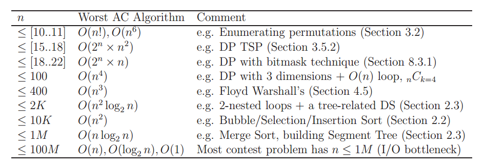

# Problem solving (Arabic)

Playlist link: https://www.youtube.com/playlist?list=PLYknlDiw2kSwdDhTSDoX7ZoVEle8nbZdk

Special thanks to Bassel Bakr, Hossam Doma, Muhammad Al-Maghraby, Ahmad Ghazaly and Muhammad Al-Halaby for their help in choosing suitable problems for each video and providing legible solutions for the problems.

## 1- Complexity of algorithms
#### Extra notes:
* The following picture (from a book called Competitive Programming 3 by Steven Halim) shows a rough estimation of the worst complexity of an algorithm that can be used for a problem of a given size.  



* An easier way to get a rough estimation of whether an algorithm will pass for a given problem size or not, is simply to substitute with the problem's limits in the upper-bound function of your algorithm.  
For example, if your algorithm is O(N^2), and N (which is the array size for example) in this problem is up to 1000. Then you can substitute N with 1000 in the N^2 equation, which will give you 1000000.  
If the number you get from this substitution is <= 10^8, then "most probably" your solution will not exceed the time limit for most of the problems (which is about 2 seconds).

#### Problems:
1. http://codeforces.com/problemset/problem/677/A
2. http://codeforces.com/problemset/problem/734/A
3. http://codeforces.com/problemset/problem/791/A
4. http://codeforces.com/problemset/problem/231/A
5. http://codeforces.com/problemset/problem/263/A
6. http://codeforces.com/problemset/problem/112/A
7. http://codeforces.com/problemset/problem/59/A
8. http://codeforces.com/problemset/problem/268/A

---

## 2- Frequency array
#### Extra notes:
* The usage of frequency arrays has its limitations. Remember that you need an array whose size is equal to the value of the largest integer in the original array. Which means that you can't use a frequency array if the values in the original array can be up to 10^9 for example.  
In most cases, you can use frequency arrays safely for values up to 10^7. However, in some websites like Codeforces, you will be given the amount of memory available for your program, which you can use to calculate (roughly) the maximum size of a frequency array that you can use.

* You can use a frequency array to sort an array in O(M) time, where M is the value of the largest integer in the array. Which could be much more efficient than merge sort (which runs in O(NlogN)) in cases where the array size is large but the values inside the array are bounded with a small number.
I'll leave it for you to think about how we could implement this function that can sort an array in O(M) using a frequency array.

#### Problems:
###### Basic problems
1. https://app.codility.com/programmers/lessons/3-time_complexity/perm_missing_elem/
2. https://app.codility.com/programmers/lessons/4-counting_elements/perm_check/
3. https://app.codility.com/programmers/lessons/4-counting_elements/missing_integer/
4. http://codeforces.com/problemset/problem/520/A

###### A little bit harder
1. https://app.codility.com/programmers/lessons/4-counting_elements/frog_river_one/
2. https://app.codility.com/programmers/lessons/4-counting_elements/max_counters/
3. http://codeforces.com/problemset/problem/767/A

---

## 3- Prefix sum
#### Extra notes:
* In many cases, you don't need the original array after you build the prefix_sum array. In these cases, it's better to "transform" your original array into a prefix_sum array, instead of creating a separate array for the prefix sum.  
Suppose that you have a zero-indexed array `A` that you want to compute a prefix sum for, then you can write:
```c
for(int i = 1; i < n; i++)  A[i] += A[i-1];
```
After this line, you can use the array `A` as a prefix_sum array. This is more memory-efficient and even faster to write.

* Remember that the sum of elements in A[L:R] = prefix_sum[R] - prefix_sum[L-1] (for L != 0).  
While the sum of elements in A[0:R] = prefix_sum[R]  

Therefore, working with 1-indexed arrays (if you have N integers for example, the first of them will be A[1] and the last will be A[N], instead of A[0] and A[N-1]) can make your life easier, as you don't have to check whether `L` is equal to zero or not before you answer the query (which results in a shorter code).  
So if you are going to input the array using `cin` for example (you can still understand the code even if you don't know `cin`), then you should create the two arrays `A` and `prefix_sum` with sizes >= N+1 and write:  
```c
for(int i = 1; i <= N; i++) cin >> A[i];
for(int i = 1; i <= N; i++) prefix_sum[i] = prefix_sum[i-1]+A[i];
```
This assumes that prefix_sum[0] = 0, which is the case by default for global variables.  
Now, the sum of elements in A[L:R] = prefix_sum[R] - prefix_sum[L-1] (for any `1 <= L <= R <= N`).

* You can use prefix sum for multi-dimensional arrays. Here is a [video](https://www.youtube.com/watch?v=PwDqpOMwg6U) that
demonstrates how this could be done for 2D arrays.  
You can apply the same concept to 3D arrays, but it will be a little bit tedious.
For higher dimensions, it's more convenient to use dynamic programming with the
inclusion-exclusion principle (which is beyond the scope of our training) to solve this kind of problems.  
It's also worth mentioning that even the simple 1D prefix sum uses (implicitly)
dynamic programming and the principle of inclusion-exclusion.

#### Problems:
1. https://app.codility.com/programmers/lessons/3-time_complexity/tape_equilibrium/
2. https://app.codility.com/programmers/lessons/5-prefix_sums/passing_cars/
3. https://app.codility.com/programmers/lessons/5-prefix_sums/genomic_range_query/  
<details>
  <summary>Need a hint for the third problem?</summary>
   We answered in the video a query the looked like "How many fives are there in a certain range in the array?".  
   You can apply the same thing for the letters 'A', 'C', 'G' and 'T' (e.g. How many 'A's are there?). And of course you can more easily check whether a letter appeared in the range or not.
</details>

###### A little bit harder
1. http://codeforces.com/problemset/problem/368/B

---

## 4- Complexity of algorithms II
#### Problems:
There are no problems for this video (at least for now), so I will add more problems for the next video to compensate.

#### Want to learn more about the analysis of algorithms?
Watch the last three videos in this [playlist](https://www.youtube.com/playlist?list=PLoK2Lr1miEm-5zCzKE8siQezj9rvQlnca).  
This playlist is also an excellent resource if you want to learn about the implementation of data structures.

---

## 5- C++
#### Extra notes:
* What I said that using `cin` makes your code shorter, I really meant that it is (usually) faster to write than `scanf`. Sorry if that wasn't clear.

#### Additional references:
You can learn more about C++ from this [website](http://www.cplusplus.com/doc/tutorial/), which also has a great documentation for the C++ STL (Standard Template Library). Just open up Google and type: cplusplus + the thing that you are searching for.  
e.g. cplusplus vector or cplusplus sort function

#### Problems:
In the last two videos, we haven't really learned a new algorithm or technique, so it's a good point to stop and practice.

###### Basic problems
1. http://codeforces.com/problemset/problem/433/B (Use the C++ STL sort function)
2. http://codeforces.com/problemset/problem/825/A
3. http://codeforces.com/problemset/gymProblem/100814/I
4. http://codeforces.com/problemset/problem/776/A
5. http://codeforces.com/problemset/problem/828/A
6. http://codeforces.com/problemset/problem/820/A
7. http://codeforces.com/problemset/problem/768/A
8. http://codeforces.com/problemset/problem/821/A   

###### A little bit harder
1. http://codeforces.com/problemset/problem/66/B
2. http://codeforces.com/problemset/problem/828/B
3. http://codeforces.com/problemset/problem/825/B
4. http://codeforces.com/problemset/problem/102/B

---

## 6- Overflow and type casting
#### Problems:
There are no problems for this video (at least for now).

---

## 7- Partial sum
#### Extra notes:
* Some people use the terms "Prefix sum" and "Partial sum" interchangeably.

* Feel free to skip this note:  
The situation we faced in the video is that we wanted to added some constant value x to all the array elements in the range [l,r].  
A harder problem would be to add x to a[l], x+k to a[l+1], x+2k to a[l+2], ... where k and x are given constants.  
Fortunately, there is an efficient solution for this task, which I will not explain here. However, here is my implementation for it if you want to have a look.

```cpp
typedef long long ll;

#define MAX 1000000+9   //Maximum array size
int a[MAX];
ll inst[MAX], perm[MAX];

///a[l] += x, a[l+1] += x+k, a[l+2] += x+2k, ...
void updateRange(int x, int k, int l, int r)
{
    inst[l] += x;
    perm[l+1] += k;
    perm[r+1] -= k;
    inst[r+1] -= x + (ll)(r-l)*k;
}

///Accumulate the values in the range [l, r] inclusive.
void acc(int l, int r)
{
    ll val = 0, inc = 0;
    for(int i = l; i <= r; i++)
    {
        val += inst[i];
        inc += perm[i];
        val += inc;

        a[i] = val;
    }
}
```

#### Problems:
1. http://codeforces.com/problemset/problem/834/B

---

## 8- Modular arithmetic
#### Problems:
1. http://codeforces.com/problemset/problem/834/A
2. https://app.codility.com/programmers/lessons/2-arrays/cyclic_rotation/

#### A little bit harder:
1. http://codeforces.com/problemset/problem/761/B
2. http://codeforces.com/problemset/gymProblem/101466/J
<details>
  <summary>Need a hint?</summary>
   Because of the modulo, the resulting array elements never exceed 3 × 10^7.  
   Therefore, sorting the array using a frequency array in O(M) will be more efficient than sorting it using merge sort in O(NlogN). (See the frequency array's section in the notes).
</details>

---

## 9- Stack
#### Problems:
###### Basic problems
1. https://app.codility.com/programmers/lessons/7-stacks_and_queues/nesting/ (This problem could be solved without using a stack).  
2.https://app.codility.com/programmers/lessons/7-stacks_and_queues/brackets/

###### A little bit harder
1. https://app.codility.com/programmers/lessons/7-stacks_and_queues/fish/
2. https://app.codility.com/programmers/lessons/7-stacks_and_queues/stone_wall/

---

## 10- Queue
#### Problems:
1. http://www.spoj.com/problems/QUEUEEZ/
2. http://www.spoj.com/problems/ADAQUEUE/
3. https://uva.onlinejudge.org/index.php?option=onlinejudge&page=show_problem&problem=1876

---

## 11- Sorting
I misspelled the word "precede" in the video, sorry for that.

#### Problems:
###### Basic problems
1. https://uva.onlinejudge.org/index.php?option=onlinejudge&page=show_problem&problem=1846 (Hint: Represent the numbers using strings).

###### A little bit harder
1. https://a2oj.com/p?ID=480    (A good problem to improve your implementation skills).
2. https://app.codility.com/programmers/lessons/6-sorting/number_of_disc_intersections/ (Challenging)

---

## 12- Set
#### Extra notes:
* Erasing elements of a multiset:  
If you say `s.erase(x)`, then all the elements in the multiset whose value = x will be erased.  
If you want to erase only one of those elements, you should say:
```cpp
multiset<int>::iterator it = s.find(x);
if(it != s.end())   s.erase(it);
```
Note that the video has been deleted and re-uploaded because of a bug related to this issue.

* You can erase elements from a set while traversing it. However, you shouldn't erase
the element that the iterator is pointing to directly, because this invalidates the iterator (statements like `it++` are no more guaranteed to run cleanly).  

For example, let's say that we have a set of integers, and we want to erase all the elements whose values are greater than x and less than y.  
You may be tempted to write the code like this:  
```cpp
for(set<int>::iterator it = s.begin(); it != s.end(); it++)
{
    if(*it > x && *it < y)  s.erase(it);
}
```
Even though this may run cleanly, it is not guaranteed.  

A safer approach would be to write:
```cpp
for(set<int>::iterator it = s.begin(); it != s.end();)
{
    if(*it > x && *it < y)
    {
        set<int>::iterator it2 = it;
        it++;
        s.erase(it2);
    }

    else it++;
}
```
Or, you could take advantage of [this](http://thispointer.com/erase-elements-from-a-set-while-iterating-in-c-generic-erase_if/) new feature (C++11).

* To make your life easier, take advantage of the "auto" keyword (C++11).  
Instead of saying `set<int>::iterator it = s.begin()`, you could say `auto it = s.begin()`. And the compiler will deduce that the data type of `it` should be `set<int>::iterator`.

* If you want to sort the elements in your set according to a certain criterion and you intend to write yourself the function that compares two elements and decides who should precede whom, then you should be cautious.  
Let's assume that your set already has an element called x, and you want to insert another element, y. If both precede(x, y) and precede(y, x) return false, then the set would decide not to insert y (remember that sets do not allow duplications) even though the elements x and y may be different.  
Don't spend much time thinking about this now, just keep this note in mind and review it whenever you need to write your "precede" function.

#### Problems:
1. https://app.codility.com/programmers/lessons/4-counting_elements/frog_river_one/ (Solve it using set).
2. https://uva.onlinejudge.org/index.php?option=com_onlinejudge&Itemid=8&page=show_problem&problem=2949
3. http://codeforces.com/problemset/problem/637/B

---

## 13- Map
#### Extra notes:
* Maps can replace frequency arrays (at the cost of the log(N) overhead), especially in cases where the original array's values are large (See the frequency array's section in the notes).

#### Problems:
1. https://uva.onlinejudge.org/index.php?option=com_onlinejudge&Itemid=8&page=show_problem&problem=1223
2. http://codeforces.com/contest/2/problem/A

---

## 14- Graph representation
This video assumes that you have watched [this](https://www.youtube.com/watch?v=HTy6ulvbQUk) video first.

#### Problems:
1. http://codeforces.com/problemset/gymProblem/101149/I

---

## 15, 16- Graph traverse (DFS & BFS)
#### Problems:
###### Basic problems
1. https://www.hackerrank.com/challenges/bfsshortreach/problem
2. http://codeforces.com/gym/101147/problem/E
3. http://codeforces.com/problemset/problem/580/C

###### A little bit harder
1. https://www.hackerrank.com/contests/world-codesprint-8/challenges/torque-and-development
2. https://uva.onlinejudge.org/index.php?option=com_onlinejudge&Itemid=8&page=show_problem&problem=410
3. http://codeforces.com/problemset/gymProblem/101149/L
4. http://codeforces.com/problemset/problem/558/C

---

## 17- Dijkstra
#### Problems:
1. https://uva.onlinejudge.org/index.php?option=com_onlinejudge&Itemid=8&page=show_problem&problem=1927
2. http://www.spoj.com/problems/SHOP/

---

## 18- DSU
#### Problems:
###### Basic problems
1. http://codeforces.com/problemset/problem/791/B
2. http://codeforces.com/problemset/problem/445/B
3. https://uva.onlinejudge.org/index.php?option=com_onlinejudge&Itemid=8&page=show_problem&problem=1099 (Online queries)

###### A little bit harder
1. http://codeforces.com/problemset/problem/884/C
2. http://codeforces.com/contest/731/problem/C

---

## 19- Dynamic programming I
Optionally, watch [this](https://www.youtube.com/watch?v=34Drti_iMsg) video first.

#### Problems:
1. https://www.spoj.com/problems/KNAPSACK/
2. http://codeforces.com/problemset/problem/35/D
3. http://codeforces.com/gym/101147/problem/H
4. http://codeforces.com/problemset/problem/699/C

## 20- Binary Search for Optimization Problems
#### Problems:
1. https://www.spoj.com/problems/BSEARCH1/
2. https://www.spoj.com/problems/AGGRCOW/
3. https://codeforces.com/problemset/problem/812/C
4. https://app.codility.com/programmers/lessons/14-binary_search_algorithm/min_max_division/
5. https://app.codility.com/programmers/lessons/14-binary_search_algorithm/nailing_planks/
6. http://codeforces.com/problemset/gymProblem/100814/G
